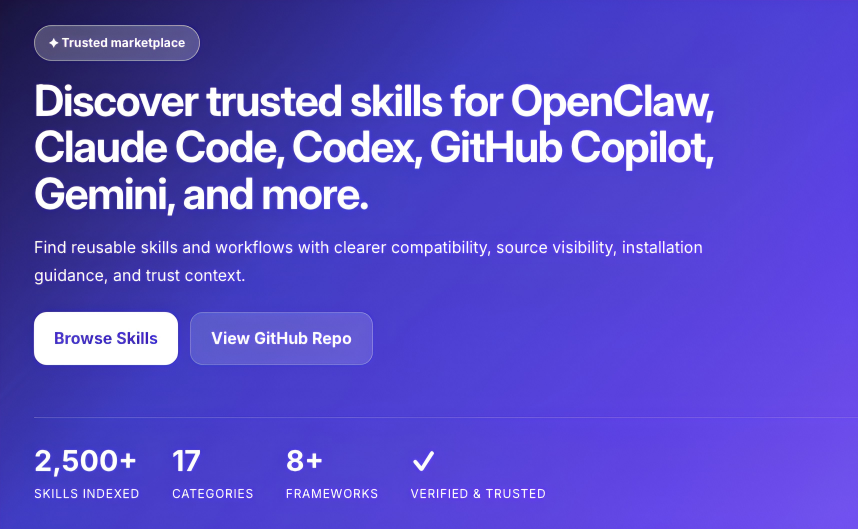
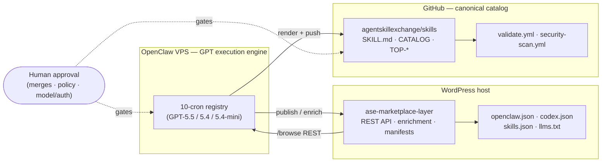

# Behind Agent Skill Exchange

> An engineering case study of an **autonomous, self-maintaining catalog** — designed by Claude Opus,
> run by a fleet of GPT-driven agents, and governed by a human at a handful of deliberate checkpoints.



*The public catalog at [agentskillexchange.com](https://agentskillexchange.com/) — the product this repo dissects.*

**Agent Skill Exchange (ASE)** is a public, curated catalog of reusable AI-agent skills:
the product at **[agentskillexchange.com](https://agentskillexchange.com/)** and the canonical
catalog at **[agentskillexchange/skills](https://github.com/agentskillexchange/skills)**
(2,500+ curated skills, 17 categories, 15 industry collections, with a published `security_reviewed` trust
tier). Almost all of it is discovered, written, verified, published, and kept fresh by agents — with
humans approving only the changes that are hard to undo.

This repo is the *story of how it works* — the architecture, the agent fleet, the model strategy,
the trust gates, and the data-integrity failure it caught and fixed. It is **not** the catalog and **not**
the operations manual (see [RELATED.md](RELATED.md)); it's the systems-engineering narrative behind them.

## By the numbers

| | |
|---|---|
| Curated skills in the catalog | **2,500+** |
| Categories · industry collections | **17 · 15** |
| Agent frameworks targeted | **8+** — OpenClaw, Claude Code, Codex, GitHub Copilot, Gemini, Cursor, MCP, LangChain… |
| Autonomous crons | **10**, across **3** GPT model tiers (`gpt-5.5` / `gpt-5.4` / `gpt-5.4-mini`) |
| Public trust signal | **`security_reviewed`** (gated, never applied to boilerplate) |
| Agent-discovery manifests | **daily** regen — `openclaw.json` · `codex.json` · `skills.json` · `llms.txt` |
| Humans in the *daily* loop | **0** — humans gate only the irreversible changes |

**Stack:** WordPress + a custom marketplace plugin (data/product) · OpenClaw scheduler running a
Codex-style GPT harness (execution) · GitHub + Actions (canonical catalog & CI) · Python/Bash
generators · Claude Opus (planning & review).

---

## The one-paragraph thesis

A traditional catalog needs editors. ASE replaces the editorial *team* with an **agent fleet** and
keeps the editorial *judgment* where it belongs — a human approving the few changes that are hard to
reverse. The design splits cleanly along two axes:

- **Plan vs. execute** — *Claude Opus* did the architecture, the reviews, and the hard root-cause
  work (this very document is part of that lineage). *GPT‑5.x models*, running inside the **OpenClaw**
  scheduler with a **Codex-style harness**, do the recurring execution.
- **Generate vs. verify** — the agents that *create* content are never the agents that *trust* it.
  Verification, security tiers, and structural invariants are enforced by separate passes and
  deterministic gates, so a confident-but-wrong generation can't promote itself.

## System at a glance



## Read it in order

| # | Doc | What it covers |
|---|-----|----------------|
| 01 | [System architecture](docs/01-system-architecture.md) | The two execution planes + GitHub, and the invariants that bind them |
| 02 | [The autonomous pipeline](docs/02-autonomous-pipeline.md) | The 10-cron loop: discover → intake → approve → publish → sync → verify → enrich → QA → improve → blog |
| 03 | [Model strategy](docs/03-model-strategy.md) | Opus-as-planner / GPT-as-executor, and the judgment-vs-mechanical model split |
| 04 | [Human in the loop](docs/04-human-in-the-loop.md) | Propose-never-publish, fail-closed gates, and the exact list of human-approval triggers |
| 05 | [Quality & trust](docs/05-quality-and-trust.md) | Security tiers, CI gates, body-quality gate, smoke tests |
| 06 | [Case study: the star-attribution bug](docs/06-case-study-star-bug.md) | A subtle data-integrity failure, its root cause, and the fix that superseded the workaround |
| 07 | [Lessons](docs/07-lessons.md) | What generalizes to any autonomous content system |

Supporting material: [`diagrams/`](diagrams/) (8 Mermaid sources — architecture, cron orchestration & schedule, discovery, approval, skill lifecycle, publish/sync sequence, star-bug) · [`artifacts/`](artifacts/)
(sanitized real scripts, schemas, and config) · [GLOSSARY.md](GLOSSARY.md) (terms) · [FAQ.md](FAQ.md) (design Q&A) · [RELATED.md](RELATED.md) (how this fits the other ASE repos).

## Repository map

```
.
├── README.md                  ← you are here
├── docs/                      ← the case study in 7 parts (read in order)
│   └── 01-system-architecture … 07-lessons
├── diagrams/                  ← standalone Mermaid sources
├── artifacts/                 ← sanitized real script, schema, config, sample batch
├── GLOSSARY.md · FAQ.md · RELATED.md
└── images/
```

## How to verify this

This is a case study, not a brochure — the public surfaces let you check the claims yourself:

- **Live catalog & manifests:** [`skills.json`](https://agentskillexchange.com/skills.json), [`openclaw.json`](https://agentskillexchange.com/openclaw.json), [`codex.json`](https://agentskillexchange.com/codex.json), and [`llms.txt`](https://agentskillexchange.com/llms.txt) at the site root — regenerated daily, each carrying per-skill signals and `verification` status.
- **Canonical catalog & CI:** [`agentskillexchange/skills`](https://github.com/agentskillexchange/skills) and its `validate.yml` + `security-scan.yml` workflows under `.github/workflows/`.
- **Trust records:** the public `verification-security` repo backing the `security_reviewed` tier.

---

### A note on scope and sanitization

This repo is written to be **public-safe** — and "sanitized" here doesn't mean "vague":

- **Included** — it's what makes the engineering legible: the architecture, the real cron schedules
  and model mapping, the public REST endpoint and manifest shapes, and a real, unmodified script diff.
- **Excluded** — a reader doesn't need it and some of it could be abused: credentials and API tokens,
  the hosts' real names and IPs, and recovery procedures and live runtime state (those stay in private
  operations docs).

The two infrastructure roles are named by function — **"OpenClaw VPS"** (execution) and **"WordPress
host"** (data/product) — because their real hosts don't matter to the story.

Artifact fidelity varies, and each file states which it is:
[`star-guard.diff`](artifacts/star-guard.diff) is **real and unmodified**; the
[cron inventory](artifacts/cron-inventory.sample.md) is **real** (schedules + models) with
infrastructure abstracted; [`enrichment-batch.example.json`](artifacts/enrichment-batch.example.json)
is **synthetic/illustrative**; and [`openclaw.manifest.schema.json`](artifacts/openclaw.manifest.schema.json)
is **derived** from the public manifests. None of it is meant to be run verbatim.

## License

Released under the [MIT License](LICENSE) © 2026 Agent Skill Exchange. Prose, diagrams, and the
sanitized code excerpts are free to reuse with attribution.
