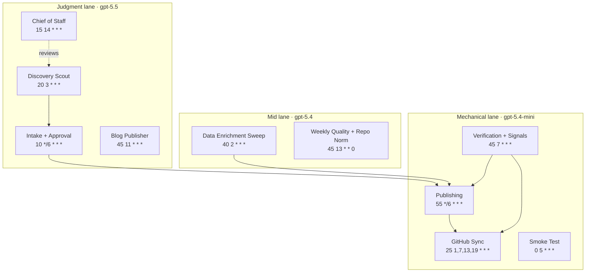

# Diagram · Cron Orchestration

The ten scheduled agents over a day, grouped by model lane. Schedules and models are the live values;
see [docs/02](../docs/02-autonomous-pipeline.md) and [docs/03](../docs/03-model-strategy.md).

