# Diagram · Daily Cron Cadence

The ten crons across a UTC day, in 6-hour blocks — the every-6h Publishing / Sync / Intake rhythm
plus the daily singletons. Schedules + models in [docs/02](../docs/02-autonomous-pipeline.md) and
[artifacts/cron-inventory.sample.md](../artifacts/cron-inventory.sample.md).

```mermaid
flowchart LR
  subgraph N["00:00–06:00"]
    direction TB
    n1["00:10 · Intake+Approval · 5.5"]
    n2["00:55 · Publishing · mini"]
    n3["01:25 · GitHub Sync · mini"]
    n4["02:40 · Data Enrichment · 5.4"]
    n5["03:20 · Discovery Scout · 5.5"]
    n6["05:00 · Smoke Test · mini"]
  end
  subgraph M["06:00–12:00"]
    direction TB
    m1["06:10 · Intake+Approval · 5.5"]
    m2["06:55 · Publishing · mini"]
    m3["07:25 · GitHub Sync · mini"]
    m4["07:45 · Verification · mini"]
  end
  subgraph A["12:00–18:00"]
    direction TB
    a1["11:45 · Blog Publisher · 5.5"]
    a2["12:10 · Intake+Approval · 5.5"]
    a3["12:55 · Publishing · mini"]
    a4["13:25 · GitHub Sync · mini"]
    a5["13:45 · Weekly QA (Sun) · 5.4"]
    a6["14:15 · Chief of Staff · 5.5"]
  end
  subgraph E["18:00–24:00"]
    direction TB
    e1["18:10 · Intake+Approval · 5.5"]
    e2["18:55 · Publishing · mini"]
    e3["19:25 · GitHub Sync · mini"]
  end
  N --> M --> A --> E
```

