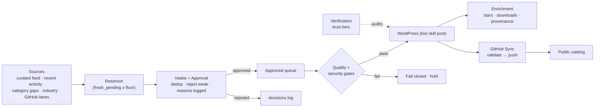

# Diagram · Discovery Flow

How a skill travels from a raw signal to a live, mirrored catalog entry. See
[docs/02](../docs/02-autonomous-pipeline.md).

```mermaid
flowchart LR
  Sources["Sources<br/>curated feed · recent activity ·<br/>category gaps · industry · GitHub lanes"]
  Sources --> Reservoir["Reservoir<br/>(fresh_pending ≥ floor)"]
  Reservoir --> Intake["Intake + Approval<br/>dedup · reject weak · reasons logged"]
  Intake -->|approved| Queue["Approved queue"]
  Intake -->|rejected| Decisions["decisions log"]
  Queue --> Pub{"Quality +<br/>security gates"}
  Pub -- pass --> WP["WordPress (live skill post)"]
  Pub -- fail --> Hold["Fail closed · hold"]
  WP --> Enrich["Enrichment<br/>stars · downloads · provenance"]
  WP --> Sync["GitHub Sync<br/>validate → push"]
  Sync --> Repo["Public catalog"]
  Verify["Verification<br/>trust tiers"] -.audits.-> WP
```
