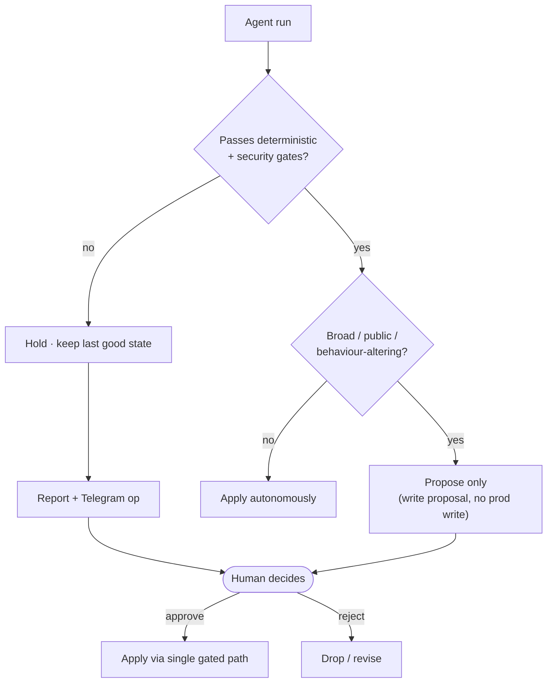

# Diagram · Human Approval Flow

How a run resolves: autonomous when reversible and gated; proposed-only when broad/public/
behaviour-altering. See [docs/04](../docs/04-human-in-the-loop.md).

**Always-human changes:** PR merges & broad rewrites · WP/plugin/theme · OpenClaw provider/model/auth
· security/trust policy · discovery-lane expansion · force-publish · count-collapse recovery.
