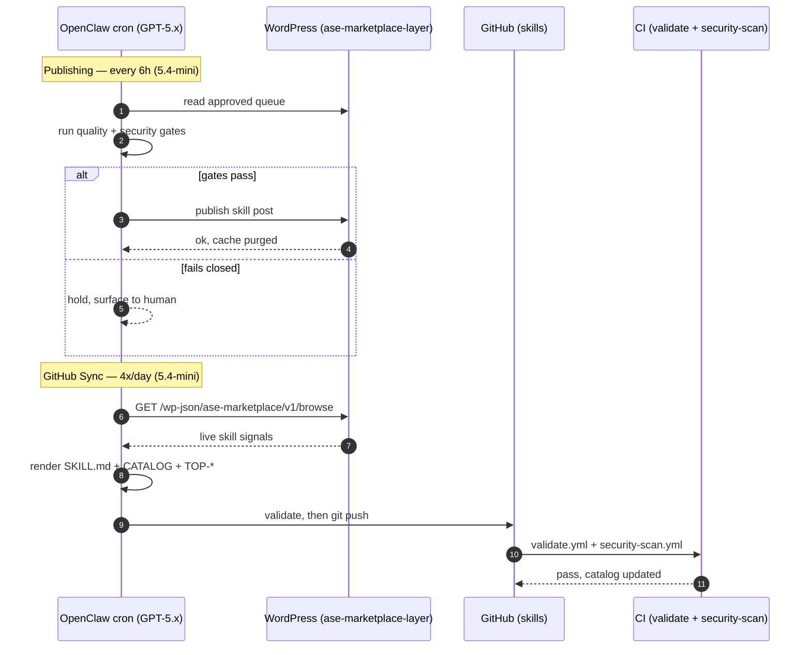

# Diagram · Publish + Sync Handshake

One publishing cycle and one GitHub-sync cycle, as the cross-system calls between the OpenClaw cron,
WordPress, GitHub, and CI. Shows where it **fails closed** and where validation gates the push. See
[docs/01](../docs/01-system-architecture.md) and [docs/02](../docs/02-autonomous-pipeline.md).

