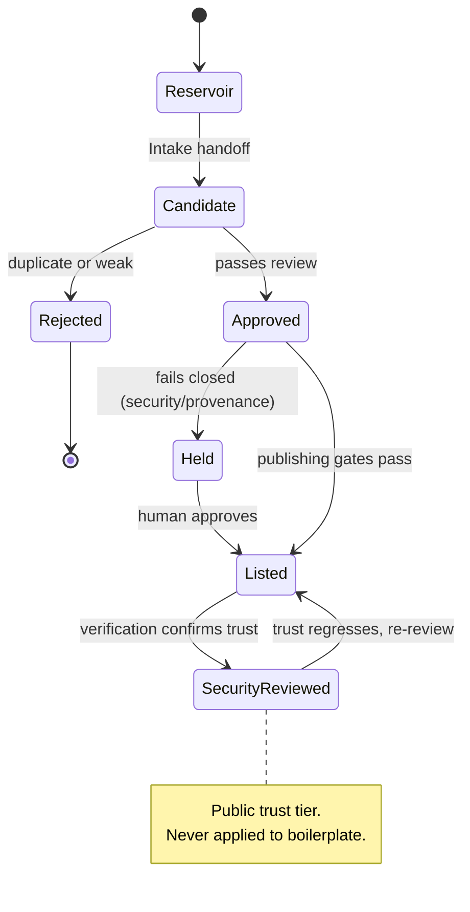

# Diagram · Skill Trust Lifecycle

A skill's states from discovery to the public `security_reviewed` trust tier — including the
fail-closed and rejection branches. See [docs/04](../docs/04-human-in-the-loop.md) and
[docs/05](../docs/05-quality-and-trust.md).

