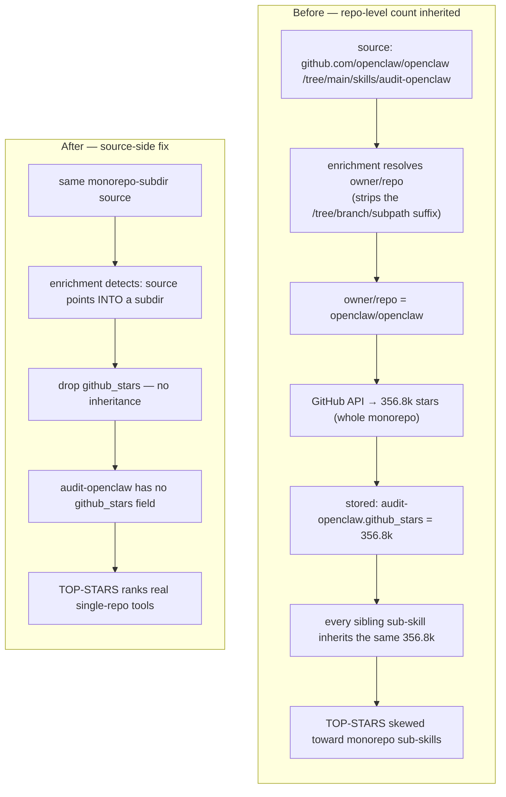

# Diagram · Star-Attribution Bug (before → after)

How a monorepo's star count wrongly propagated to every sub-skill, and how the source-side fix stops
it. Full story in [docs/06](../docs/06-case-study-star-bug.md).

