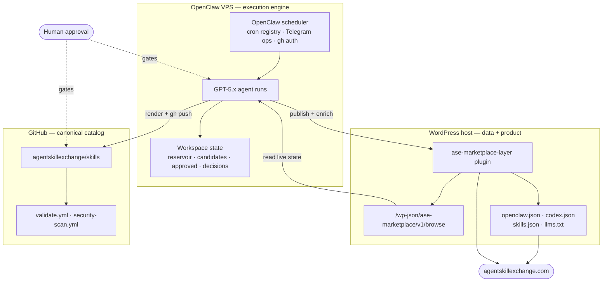

# Diagram · System Architecture

Two execution planes (OpenClaw VPS, WordPress host) plus the GitHub canonical catalog, with the human
approval gates. Source for the overview in [docs/01](../docs/01-system-architecture.md).

