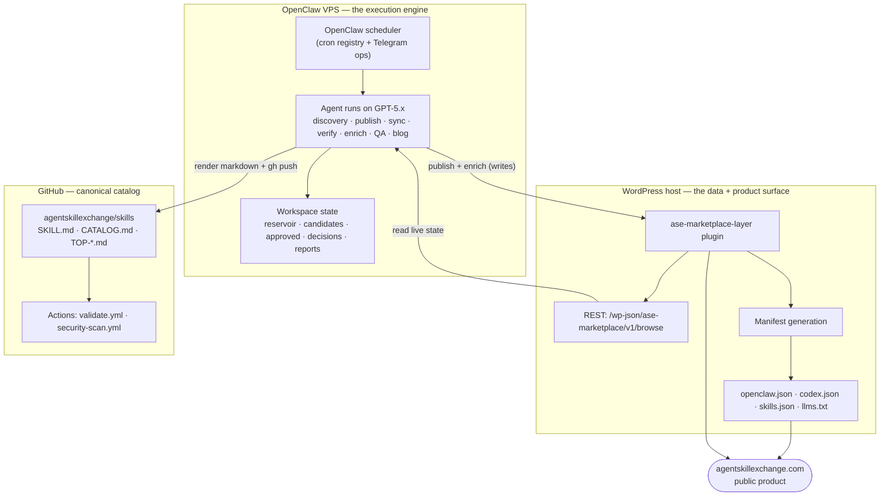

# 01 · System Architecture

ASE runs on **two execution planes plus GitHub**. Each has one job, and the contracts between them
are narrow and explicit. That separation is what lets a fleet of autonomous agents operate a public
product without a human babysitting every run.

## Plane 1 — the OpenClaw VPS (execution engine)

The autonomous behaviour lives here. **OpenClaw** is the runtime: it owns a cron registry, runs
each scheduled task as a model-backed agent against a configured OpenAI provider model, exposes a
Telegram operations channel, and authenticates to GitHub through the `gh` CLI's stored credentials
for repo reads and writes.

- **Workspace:** `~/.openclaw/workspace/AgentSkillExchange` — holds the pipeline scripts
  (e.g. `ase_pipeline_health.py`) and the discovery state files the agents read and write
  (`discovery-reservoir.json`, `discovery-candidates.json`, `discovery-approved.json`,
  `discovery-decisions.md`, plus per-run reports).
- **What it never does on its own:** change provider/model/auth config, expand discovery lanes,
  force-publish, or recover from a count collapse. Those are human-approved (see
  [04 · Human in the loop](04-human-in-the-loop.md)).

## Plane 2 — the WordPress host (data + product surface)

WordPress is both the **system of record for live skill data** and the **public product**. A single
custom plugin, **`ase-marketplace-layer`**, carries the weight:

- registers the skill content type and its metadata,
- exposes the read API the agents depend on — `GET /wp-json/ase-marketplace/v1/browse`
  (paginated, returns per-skill signals: `github_stars`, `npm_downloads`, `tool_match`, `slug`,
  `verification`, categories, …),
- applies the enrichment and publish writes the agents send,
- **generates the agent-discovery manifests** served at the web root:
  `openclaw.json`, `codex.json`, `skills.json` (each `schema: openclaw-skills/1.0`,
  carrying `total` and a `skills[]` array) and `llms.txt`.

These manifests are how *other* agent runtimes (OpenClaw, Codex, Cursor, Claude Code, Copilot,
Gemini, …) discover the catalog — the same content, shaped per consumer.

## Plane 3 — GitHub (canonical catalog)

The public repo is the **canonical, human-auditable catalog**, and it is deliberately a
**renderer, not a source of truth**: the generation scripts pull live state from the WordPress
`/browse` API and render `SKILL.md` files, `CATALOG.md`, and the `TOP-STARS.md` / `TOP-DOWNLOADS.md`
leaderboards. Two GitHub Actions guard it — `validate.yml` (structure/schema) and
`security-scan.yml` (content safety) — so a bad sync is caught at the door.

> Why renderer-not-source matters: it gave us exactly one place to fix a data bug. See
> [06 · The star-attribution bug](06-case-study-star-bug.md).

## The contracts that bind the planes

The whole thing stays coherent because of a small set of **invariants** the pipeline enforces:

1. **WordPress and the public repo agree** on skill totals and verification counts.
2. **The public JSON endpoints stay available** — `skills.json`, `openclaw.json`, `codex.json`,
   `llms.txt`.
3. **Discovery favours fresh, source-backed, non-duplicate candidates.**
4. **Publishing fails closed** on any security or provenance problem.
5. **Repo sync validates before it pushes**, and never labels boilerplate as `security_reviewed`.

Each invariant maps to a guardrail in the pipeline ([02](02-autonomous-pipeline.md)) or a gate in
the quality layer ([05](05-quality-and-trust.md)). When one is violated, the system surfaces it and
an internal runbook says exactly what to check first.

## Data flow in one sentence

A skill is **discovered** on the VPS, **approved** against the live catalog, **published** into
WordPress, **enriched** with ecosystem signals, **rendered and pushed** to GitHub, **verified** for
trust, and **smoke-tested** end-to-end — and every one of those verbs is a scheduled agent on a
specific model, described next in [02 · The autonomous pipeline](02-autonomous-pipeline.md).

---

**Diagrams:** [system architecture](../diagrams/system-architecture.md) · [publish + sync sequence](../diagrams/publish-sync-sequence.md) · [← README](../README.md) · [Contents](../README.md#read-it-in-order) · [Next: The autonomous pipeline →](02-autonomous-pipeline.md)
