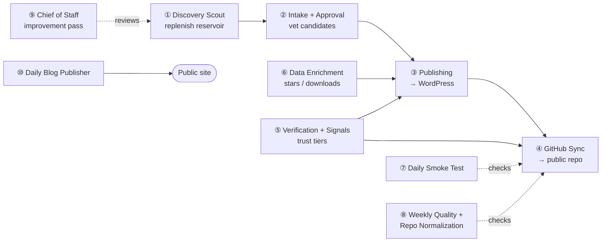

# 02 · The Autonomous Pipeline

The system is a **registry of ten scheduled agents**, each with a single responsibility, a fixed
cadence, a chosen model, and an explicit set of surfaces it is allowed to write. Together they form
a loop that discovers new skills, vets them, publishes them, keeps their signals fresh, mirrors them
to GitHub, and continuously checks its own work.

## The registry

Times are the live cron schedules; models are the configured OpenAI provider models (see
[03 · Model strategy](03-model-strategy.md) for the *why*). "Writes" shows which production surfaces
each agent may touch — the blast radius of a bad run.

| # | Cron | Schedule | Model | Writes |
|---|------|----------|-------|--------|
| ① | Discovery Scout Replenish | `20 3 * * *` | `gpt-5.5` | queue |
| ② | Discovery Intake + Approval | `10 */6 * * *` | `gpt-5.5` | queue |
| ③ | Discovery Publishing | `55 */6 * * *` | `gpt-5.4-mini` | WordPress, queue |
| ④ | GitHub Sync | `25 1,7,13,19 * * *` | `gpt-5.4-mini` | WordPress, repo |
| ⑤ | Daily Verification Scan + Signals Refresh | `45 7 * * *` | `gpt-5.4-mini` | WordPress |
| ⑥ | Data Enrichment Sweep | `40 2 * * *` | `gpt-5.4` | WordPress |
| ⑦ | Daily Smoke Test | `0 5 * * *` | `gpt-5.4-mini` | — |
| ⑧ | Weekly Quality Report + Repo Normalization | `45 13 * * 0` | `gpt-5.4` | repo |
| ⑨ | Chief of Staff Daily Improvement Pass | `15 14 * * *` | `gpt-5.5` | — |
| ⑩ | Daily Blog Publisher | `45 11 * * *` | `gpt-5.5` | WordPress |

A sanitized copy of this table lives in [`artifacts/cron-inventory.sample.md`](../artifacts/cron-inventory.sample.md).

### The day, in 6-hour blocks

The same ten crons laid out across a UTC day — note the every-6h Publishing / Sync / Intake rhythm,
with the judgment-heavy singletons (Scout, Blog, Chief of Staff) spread through the day:

```mermaid
flowchart LR
  subgraph N["00:00–06:00"]
    direction TB
    n1["00:10 · Intake+Approval · 5.5"]
    n2["00:55 · Publishing · mini"]
    n3["01:25 · GitHub Sync · mini"]
    n4["02:40 · Data Enrichment · 5.4"]
    n5["03:20 · Discovery Scout · 5.5"]
    n6["05:00 · Smoke Test · mini"]
  end
  subgraph M["06:00–12:00"]
    direction TB
    m1["06:10 · Intake+Approval · 5.5"]
    m2["06:55 · Publishing · mini"]
    m3["07:25 · GitHub Sync · mini"]
    m4["07:45 · Verification · mini"]
  end
  subgraph A["12:00–18:00"]
    direction TB
    a1["11:45 · Blog Publisher · 5.5"]
    a2["12:10 · Intake+Approval · 5.5"]
    a3["12:55 · Publishing · mini"]
    a4["13:25 · GitHub Sync · mini"]
    a5["13:45 · Weekly QA (Sun) · 5.4"]
    a6["14:15 · Chief of Staff · 5.5"]
  end
  subgraph E["18:00–24:00"]
    direction TB
    e1["18:10 · Intake+Approval · 5.5"]
    e2["18:55 · Publishing · mini"]
    e3["19:25 · GitHub Sync · mini"]
  end
  N --> M --> A --> E
```

## What each agent actually does

**① Discovery Scout Replenish** — keeps the discovery *reservoir* above a pending floor, pulling from
a curated emerging feed, recent-activity signals, category gaps, industry needs, and bounded GitHub
search lanes. Reads the reservoir + live catalogs + GitHub; writes an updated
`discovery-reservoir.json` and a scout report. *Success:* `fresh_pending ≥ floor`, `starved = false`.

**② Discovery Intake + Approval** — the editorial brain. Reviews candidates handed off by the Scout,
rejects duplicates and weak entries with reasons, and writes the approved queue. Reads candidates +
reservoir + live catalogs; writes `discovery-decisions.md` and `discovery-approved.json`. Nothing it
does is public yet — it only fills a queue.

**③ Discovery Publishing** — drains the approved queue into WordPress *only* when each item passes the
quality and security gates; skips cleanly when the queue is empty. First agent in the loop that
touches a production surface.

**④ GitHub Sync** — aligns WordPress skill data with the public repo: renders the catalog artifacts
and pushes. Validates before pushing; never publishes boilerplate as `security_reviewed`.

**⑤ Daily Verification Scan + Signals Refresh** — refreshes trust tiers and source signals against the
verification rules. Keeps `security_reviewed` honest.

**⑥ Data Enrichment Sweep** — refreshes ecosystem metadata (GitHub stars, npm downloads, source
provenance) for catalog items. *This is the agent at the centre of the
[star-attribution case study](06-case-study-star-bug.md)* — enrichment is exactly where a subtle
data bug can enter at scale.

**⑦ Daily Smoke Test** — exercises public endpoints and key flows; writes a fail-closed daily report.
Touches nothing — pure observation.

**⑧ Weekly Quality Report + Repo Normalization** — Sundays: a deeper quality pass and repo cleanup,
the one weekly write to the public repo.

**⑨ Chief of Staff Daily Improvement Pass** — a meta-agent that reviews how the system itself is doing
and proposes improvements. Writes nothing to production — it *proposes*, a human disposes.

**⑩ Daily Blog Publisher** — generates and publishes scheduled editorial posts (the
"…spotlight"-style content on the site) against a calendar/tracker with visual-quality checks.

## Reading the cadence

- **Fast loops, small blast radius.** The two surfaces that change most often — Publishing and the
  GitHub Sync — run every 6 hours on the *smaller* model, because by the time work reaches them the
  judgment has already happened upstream and the task is mechanical.
- **Slow loops, more judgment.** Scout and Intake/Approval (where quality is decided) and the
  Chief-of-Staff and Blog agents (where taste matters) run on the *stronger* model.
- **Observation is continuous and free of side effects.** Smoke (daily) and Weekly Quality watch the
  public surfaces without the power to corrupt them.

## Guardrails are part of the pipeline, not bolted on

Every writing agent has a **success signal**, a list of **common failures**, a **safe read-only
verification command** (`python3 scripts/ase_pipeline_health.py --json`), and a **human-intervention
trigger** baked into its operating brief. The pipeline is designed to *fail closed and ask*, not to
*push through and hope* — which is the subject of [04 · Human in the loop](04-human-in-the-loop.md).

---

**Diagrams:** [cron orchestration](../diagrams/cron-orchestration.md) · [cron schedule](../diagrams/cron-schedule.md) · [discovery flow](../diagrams/discovery-flow.md) · [publish + sync sequence](../diagrams/publish-sync-sequence.md) · [← System architecture](01-system-architecture.md) · [Contents](../README.md#read-it-in-order) · [Next: Model strategy →](03-model-strategy.md)
