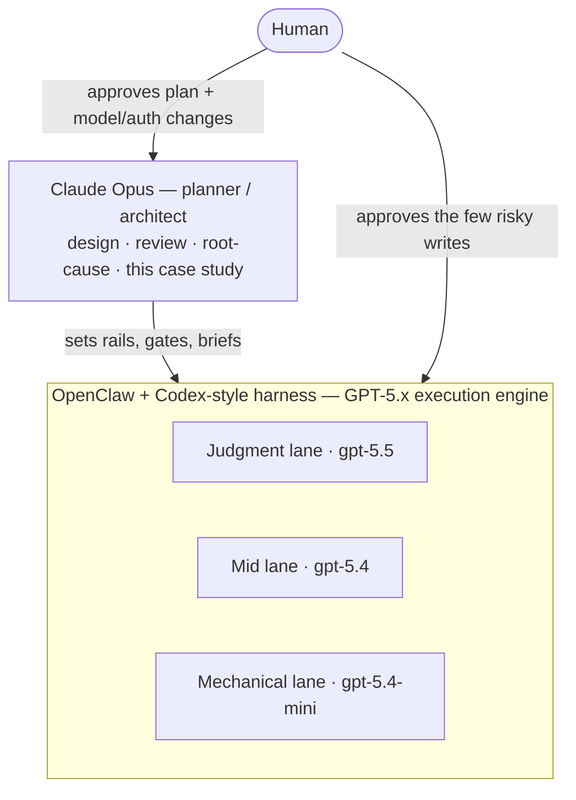

# 03 · Model Strategy

ASE uses models on **two levels**, and conflating them is the most common way to misunderstand the
system.

## Level 1 — Plan vs. execute

- **Claude Opus is the planner / architect.** It designed the system, runs the deep reviews, and
  does the hard root-cause work — the kind of thinking that happens *occasionally* and must be
  *right*. The review history that produced this case study (including the
  [star-attribution root cause](06-case-study-star-bug.md)) is Opus work. Planning is bursty,
  expensive-per-call, and human-supervised.
- **GPT‑5.x models are the execution engine.** They run *continuously*, inside the **OpenClaw**
  scheduler with a **Codex-style harness**, doing the recurring work the plan defined: discover,
  approve, publish, sync, verify, enrich, report, write blog posts. Execution is cheap-per-call,
  high-frequency, and mostly unsupervised — which is only safe because the plan and the gates
  constrain it.

This is the literal shape of the project: **"planned with Claude Opus, executed by GPT models via
OpenClaw + Codex."** The planner sets the rails; the executors run the trains.

## Level 2 — Judgment vs. mechanical (within the GPT fleet)

Not every recurring task deserves the strongest model. The fleet is tiered by *how much judgment the
task requires*, with the deliberate principle: **use a stronger model where judgment is decided; use
a smaller/faster model where scripts enforce the real gates.**

| Lane | Model | Crons | Why |
|------|-------|-------|-----|
| **Judgment** | `gpt-5.5` | Discovery Scout, Intake + Approval, Chief of Staff, Blog Publisher | Quality, taste, and "should this exist?" decisions — keep on the stronger model. |
| **Mid** | `gpt-5.4` | Data Enrichment Sweep, Weekly Quality + Repo Normalization | Heavier mechanical work with some interpretation. |
| **Mechanical** | `gpt-5.4-mini` | Publishing, GitHub Sync, Daily Verification, Daily Smoke | Script-heavy; the gates do the real enforcement, so a smaller/faster model is appropriate. |

The key insight: **by the time work reaches a mechanical lane, the judgment has already been made
upstream.** Publishing doesn't decide *whether* a skill is good — Intake/Approval did that, on
`gpt-5.5`. Publishing just executes the gates. So it can run on `gpt-5.4-mini` every six hours
cheaply, and the system's quality doesn't depend on its model choice.

## Rules we operate by

- **Model changes are production-config changes.** A model swap alters autonomous behaviour, so it is
  reviewed and human-approved like any other config change — never done casually.
- **Don't change models during an incident** unless the provider/model itself *is* the incident.
- **Provider/model/auth config is human-gated.** OpenClaw's provider settings (and the GitHub auth it
  uses for repo writes) only change with explicit approval.
- **Scripts enforce gates, not models.** We never rely on "a smarter model will catch it." If a
  property must hold, a deterministic check holds it — see [05 · Quality & trust](05-quality-and-trust.md).

## Cost shape (why this tiering pays off)

Frequency × model cost is dominated by the high-frequency mechanical lanes — Publishing and GitHub
Sync run every 6 hours, Verification and Smoke daily. Putting those on `gpt-5.4-mini` keeps the
always-on cost low, while the genuinely judgment-bearing work (a handful of runs per day) gets the
stronger model where it actually changes outcomes. The result is an autonomous system whose
*running* cost scales with mechanical volume, not with the price of the smartest model.

> **On real numbers:** this section argues the *shape* of the cost, not a dollar figure. The actual
> monthly fleet cost, weekly publish volume, and human-intervention rate are operational metrics —
> see [How to verify](../README.md#how-to-verify-this) for the public surfaces that expose live state.

---

**Diagram:** [cron orchestration](../diagrams/cron-orchestration.md) · [← The autonomous pipeline](02-autonomous-pipeline.md) · [Contents](../README.md#read-it-in-order) · [Next: Human in the loop →](04-human-in-the-loop.md)
