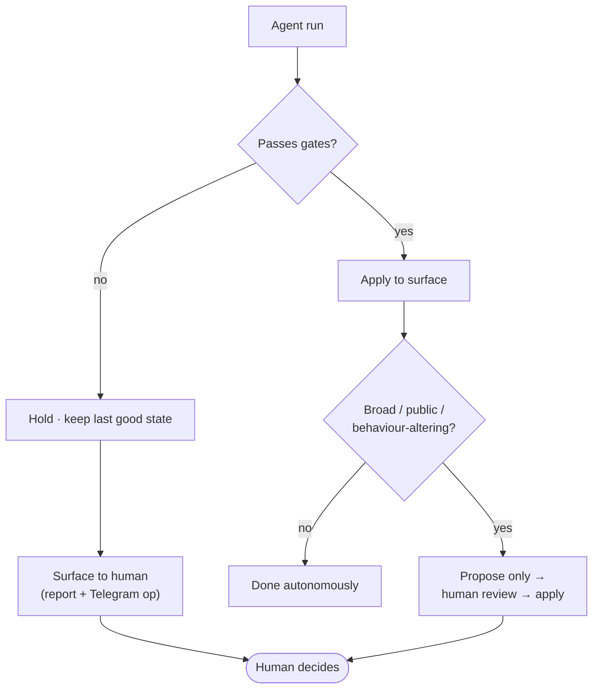

# 04 · Human in the Loop

"Autonomous" does not mean "unsupervised." ASE is designed so that automation owns the **high-volume,
reversible** decisions and a human owns the **few decisions that are hard to undo or that change what
the system is allowed to do**. The art is in drawing that line precisely — narrow enough that the
human isn't a bottleneck, wide enough that no single bad agent run can quietly damage a public
product.

## The governing principle: propose, never publish (at the risky edges)

The agents that operate on the *inside* of the system publish freely within their gates — that's the
point of automation. But at every place where a change is **broad, public, or behaviour-altering**,
the pattern flips to **propose → human review → apply**:

- The **Chief of Staff** agent reviews the system and *proposes* improvements; it writes nothing to
  production.
- Repo-wide rewrites and PR merges are *prepared* by agents but *merged* by a human.
- Discovery only *queues* candidates; even approved items pass security/provenance gates before they
  go live, and the lanes that feed discovery can only be *expanded* with approval.

This mirrors a pattern used in a sibling autonomous system (a market-intelligence monitor) where a
scheduled agent writes a dated proposal file and a human applies the good entries through a single
gated publish path. The lesson carried over: **the monitor proposes; a human disposes; there is
exactly one path to production.**

## What requires a human

These are the changes automation is explicitly **not** allowed to make on its own:

| Change | Why it needs a human |
|--------|----------------------|
| PR merges or broad repo rewrites | The public canonical catalog can change at scale. |
| WordPress / plugin / theme changes | Production site behaviour can change. |
| OpenClaw provider / model / auth changes | Autonomous behaviour and access can change. |
| Security / trust policy changes | A public trust signal (`security_reviewed`) can shift. |
| Discovery lane expansion | Candidate quality and load can shift quickly. |
| Force-publish behaviour | It can bypass the normal safety gates. |
| Recovery from a count collapse | Risk of restoring a bad trust state without evidence. |

Everything *not* on this list — the daily discover/approve/publish/sync/verify/enrich/QA/blog loop —
runs autonomously.

## Fail closed, then ask

The default failure mode is **stop and surface**, never **push through**:

- **Publishing fails closed** on any security or provenance problem — a questionable skill simply
  doesn't go live.
- **Repo sync validates before it pushes** — a failed validation aborts the push rather than shipping
  a broken catalog.
- **A rejected/failed run leaves the prior good state in place** — the last known-good output keeps
  serving while a human looks.
- Each writing cron carries an explicit **human-intervention trigger** in its brief (e.g. "reservoir
  starved for two runs," "approvals stuck at 0 despite a healthy reservoir," "risky/high-impact skills
  appear"). The system knows the conditions under which it should ask for help.

## How the human actually observes

The human isn't polling dashboards all day. Three things make oversight cheap:

1. **Read-only health is one command.** `python3 scripts/ase_pipeline_health.py --json` gives a
   machine-readable state of the pipeline without touching anything.
2. **Every run writes a report.** Decisions logs, publish reports, smoke/weekly reports — the trail
   is durable and greppable.
3. **Symptoms map to runbooks.** When something looks off, internal operations runbooks route each
   symptom ("cron stale," "live/repo totals differ," "`security_reviewed` dropped sharply") to a
   specific first read-only check.

Those operations runbooks hold the *how* (and are kept private); this document holds the design
*why*. The boundary between "the system decides" and "the human decides" is the most important
interface in the whole architecture — and it's deliberately small.

---

**Diagram:** [human approval flow](../diagrams/human-approval-flow.md) · [← Model strategy](03-model-strategy.md) · [Contents](../README.md#read-it-in-order) · [Next: Quality & trust →](05-quality-and-trust.md)
