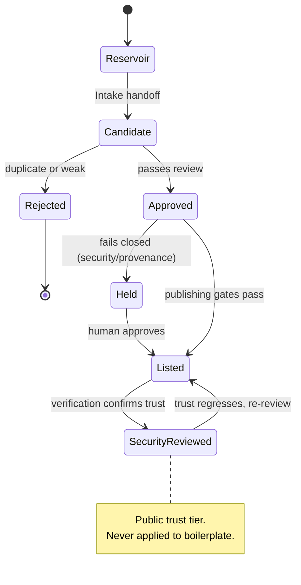
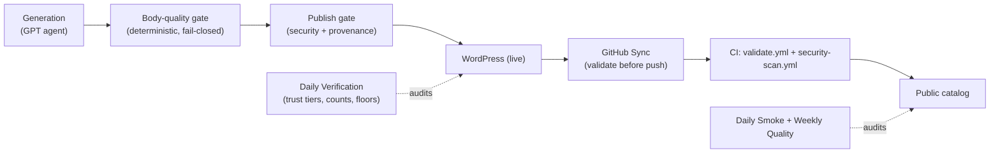

# 05 · Quality & Trust

A public catalog lives or dies on whether its signals can be trusted. ASE's central design rule is
**the agent that generates content is never the agent that trusts it.** Generation and verification
are separate passes, and trust is enforced by deterministic gates rather than by asking a model to
grade its own work.

## The trust tier

Every skill carries a verification status; the one that matters publicly is **`security_reviewed`**.
It is a *claim about safety*, so it is governed by rules, not vibes:

- the **Daily Verification Scan** (cron ⑤) refreshes trust tiers and source signals against the
  verification rules;
- **boilerplate is never published as `security_reviewed`** — a generic or templated body cannot earn
  the trust label;
- the reviewed-vs-listed counts have floors, so a sudden drop is a *detectable regression*, not a
  silent erosion (it maps to a specific internal runbook);
- the public review records live in the `verification-security` repo, separate from the catalog.

### A skill's path to trust

A skill only reaches the public `security_reviewed` tier by passing through gated states — and any
gate can send it back or out:

## Two CI gates on the public repo

The canonical repo is guarded at the door by GitHub Actions, independent of whatever ran on the VPS:

- **`validate.yml`** — structural/schema validation of `SKILL.md` files and the generated catalog.
- **`security-scan.yml`** — content safety scanning.

Because the repo is a **renderer, not a source of truth**, these gates protect the *public* artifact
even if something upstream went wrong — a second, independent line of defence after the VPS-side
publish gates.

## The body-quality gate (a generation failure caught deterministically)

Auto-generated skill bodies once leaked **table-of-contents fragments** from upstream docs
(stray lines like "4.2. Docker context", "Introduction", "2.1. Arch") and carried **stale star
prose** in the text after the underlying numbers changed. The `security_reviewed` tier did *not*
catch this — a skill could be security-reviewed and still have a garbled body, because security and
body-quality are different properties.

The fix was a **fail-closed body-quality gate** wired into generation: a deterministic check that
rejects TOC-fragment leakage and flags star prose that has drifted from the live numbers (within a
tolerance), wired into the generation pipeline so a bad body can't ship. The principle:
**if a property must hold, a deterministic gate holds it — don't hope a smarter model notices.**

## Why deterministic gates beat an "LLM judge"

A recurring temptation in autonomous systems is to add a second model that "grades" the first.
A sibling ASE-adjacent system evaluated exactly this and chose against it, for reasons that apply
here too:

- **Coverage, counts, schema, and tier integrity are deterministic properties** — plain code checks
  them perfectly, at zero token cost, with a reproducible verdict.
- **An LLM judge inflates cost** (often ~50% more tokens to re-check what code checks for free) and is
  **non-deterministic** — it can mis-pass or hallucinate a problem.
- **Deterministic gates fail closed and are testable**, which is exactly what you want guarding a
  public surface.

The rule of thumb ASE follows: **use models to generate and to judge taste; use code to enforce
invariants.** An LLM summary is fine as a *human-facing alert when a deterministic gate trips* — but
the gate, not the model, is what blocks the bad output.

## The layers, end to end

Five independent checkpoints — body-quality, publish gate, validate-before-push, CI, and the daily
verification/smoke audits — each able to stop a bad change, none of them trusting the generator that
produced it. That redundancy is what makes "publish without a human in the loop" defensible.

See the next document, [06 · The star-attribution bug](06-case-study-star-bug.md), for what happens
when a data error slips *past* generation and into enrichment — and how the renderer-not-source
design made it fixable in exactly one place.

---

**Diagram:** [skill lifecycle](../diagrams/skill-lifecycle.md) · [← Human in the loop](04-human-in-the-loop.md) · [Contents](../README.md#read-it-in-order) · [Next: The star-attribution bug →](06-case-study-star-bug.md)
