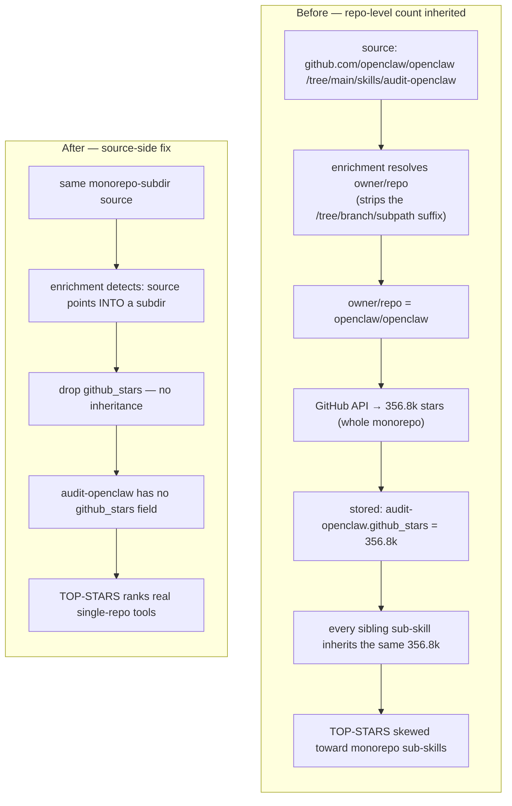

# 06 · Case Study — The Star-Attribution Bug

This is the data-integrity failure that best shows the architecture under stress: the inflated
numbers were **real**, which is exactly why it was dangerous. It's a clinic in how a subtle error
enters an autonomous system at scale, how a renderer-not-source design localises the fix, and why the
*right* fix wasn't the first one that worked.

## Symptom

The catalog's popularity signals were wrong in a very specific way: a single sub-skill would display
a **whole monorepo's** GitHub star count. The worst offenders:

- `openclaw/openclaw` (the skills monorepo of the same OpenClaw project that schedules ASE — same
  name, different role) → **356.8k** stars leaking onto 4 distinct skills, including `audit-openclaw`,
  `turn-github-issues-into-fix-prs`, and `check-weather`
- `anthropics/skills` → ~116k onto ~10 skills
- `openai/skills` → 17.3k onto 4; `anthropics/claude-code` → 116.8k onto 2; plus `wshobson/agents`,
  `addyosmani/agent-skills`, `microsoft/skills`, and more.

In total, **61 skills across ~25 "agent-skill" monorepos** were inflated. The corrupt numbers showed
up everywhere downstream: `TOP-STARS.md`, `CATALOG.md`, every `categories/*/README.md`, and the live
`/industry-skills` pages.

The trap: these weren't *fabricated* or miscalculated numbers, and it wasn't a formatting bug. Each
figure was a **real repository's** stargazer count as the enrichment had recorded it — just attached
at the **wrong granularity**, a single folder credited with its whole repository's popularity.
Nothing looked obviously broken; the leaderboard just quietly favoured monorepo sub-skills over
genuinely popular single-purpose tools.

## Investigation — ruling out the renderer

The first hypothesis is always "the thing that displays the number is dividing wrong." We ruled the
renderer out cleanly:

- The repo's `generate-top-lists.sh` fetches `github_stars` straight from the WordPress
  `/wp-json/ase-marketplace/v1/browse` API and formats it; its `fmt_num` divides correctly. **No
  formatting bug.** The repo is a *pure renderer* of whatever the API serves.
- Therefore the corruption had to originate **upstream, in the WordPress enrichment** that *writes*
  `github_stars`.

## Root cause

The **Data Enrichment Sweep** (cron ⑥) resolves each skill's `source` URL to an `owner/repo`,
**strips the `/tree/<branch>/<subpath>`**, and queries GitHub for that repository's stargazer count —
then stores the **whole repo's** count as that single sub-skill's `github_stars`.

For a skill that *is* a whole repo, that's correct. For a skill that is one folder inside a monorepo
of skills, it's wrong: every sibling folder inherits the same large number. One enrichment shortcut,
multiplied across every monorepo in the catalog, produced the 61 inflated rows.

### The bug in one picture



## The two fixes — and why the order mattered

### Fix A — the read-side guard (the workaround)

The immediate, defensible move was to stop the bad numbers at the renderer. The catch:
**the `/browse` API doesn't expose each skill's `source` URL**, so the guard reads `source` from the
local `skills/<slug>/SKILL.md` frontmatter, detects when it points *into* a monorepo subdirectory,
and **nulls** that star value before any ranking or rendering.

The core of it (full diff in [`artifacts/star-guard.diff`](../artifacts/star-guard.diff)):

```python
# Matches github.com/<owner>/<repo>/(tree|blob)/<ref>/<something-more>
MONOREPO_RE = re.compile(
    r"github\.com/(?P<owner>[^/\s]+)/(?P<repo>[^/\s]+)/(?:tree|blob)/[^/\s]+/.+",
    re.IGNORECASE,
)

def monorepo_parent(url):
    """If url points into a repo subdir/file, return 'owner/repo'; else None.
    Repo-root URLs (optionally /tree/<branch> with no further path) return None."""
    m = MONOREPO_RE.search(url.strip()) if url else None
    return f"{m.group('owner')}/{m.group('repo')}" if m else None

def apply_star_guard(items_list):
    for item in items_list:
        if int(item.get("github_stars") or 0) <= 0:
            continue
        if monorepo_parent(read_source_from_frontmatter(item.get("slug", ""))):
            item["github_stars"] = 0   # repo-level count, not skill-level → drop it
```

It worked: 61 attributions nulled, zero inflated rows left, and `TOP-STARS` re-ranked to legitimate
single-repo tools. But the guard's own log message names its limitation honestly:

> `NOTE: this guard only removes monorepo inheritance. It does NOT correct wrong-repo matches or
> stale counts — fix those in the source enrichment.`

A guard at the renderer is **belt-and-suspenders**: the 6-hourly sync would keep re-importing bad
data from WordPress, so the renderer would have to keep cleaning it forever. The real defect was
still upstream.

### Fix B — the source-side fix (the correct one)

The durable fix landed where the data is *written*: the enrichment now **drops `github_stars`
entirely for monorepo-subdirectory skills** instead of inheriting the parent repo's count
(349 of the ~2,548 skills in the catalog legitimately end up with no `github_stars`
field). After the source fix:

- the remaining `TOP-STARS` entries verified accurate against the live GitHub API (within ~0–10%,
  mild staleness only);
- the `openclaw`/`anthropics`/`openai` offenders were gone;
- and the read-side guard became **unnecessary** — superseded by the source fix.

The same source-side pass also retired a frozen `sync-summary.json`, cleaned the TOC-fragment leakage,
and added the fail-closed [body-quality gate](05-quality-and-trust.md).

## What this case proves about the architecture

- **Renderer-not-source gave us one place to look.** Because the repo only *renders* the API, we
  could rule it out in minutes and know the bug was in enrichment. A system where the catalog was its
  own source of truth would have had two suspects and twice the surface area.
- **The fast workaround and the right fix are different things.** Fix A stopped the bleeding at the
  display layer in one review cycle; Fix B removed the cause. Shipping A first was correct *and*
  knowing it was a workaround was correct — the guard literally documents that the real fix belongs
  upstream.
- **Fix where the data is written, not where it's read.** The general rule this case burned in:
  a guard at the read side is reasonable insurance, but if the same bad value keeps arriving, the
  fix has to land at the writer or you maintain the workaround forever.
- **Real-but-wrong is the hardest class of data bug.** No exception, no obviously-fake number — just
  a correct value at the wrong granularity. The only defence is *provenance awareness*: knowing that
  a number attached to a sub-path cannot be the sub-path's own.

## Residual honesty

A separate class of attribution noise (wrong-repo matches or stale counts on a few repo-root skills,
e.g. a `yt-dlp` figure higher than the live count) is **out of scope** for the monorepo guard and is
addressed in the enrichment, not the renderer. Naming what a fix *doesn't* cover is part of the fix.

Next: [07 · Lessons](07-lessons.md) — what generalises from all of this to any autonomous content
system.

---

**Diagram:** [star-attribution before/after](../diagrams/star-attribution.md) · [← Quality & trust](05-quality-and-trust.md) · [Contents](../README.md#read-it-in-order) · [Next: Lessons →](07-lessons.md)
